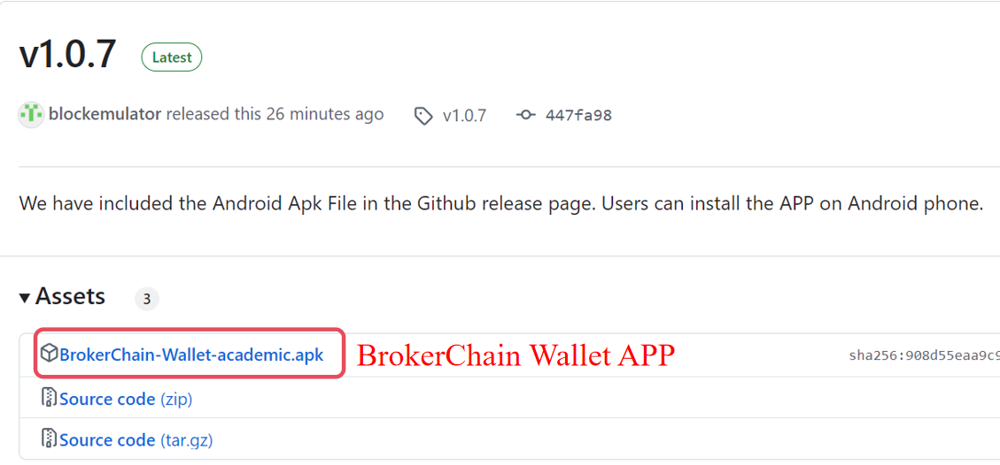
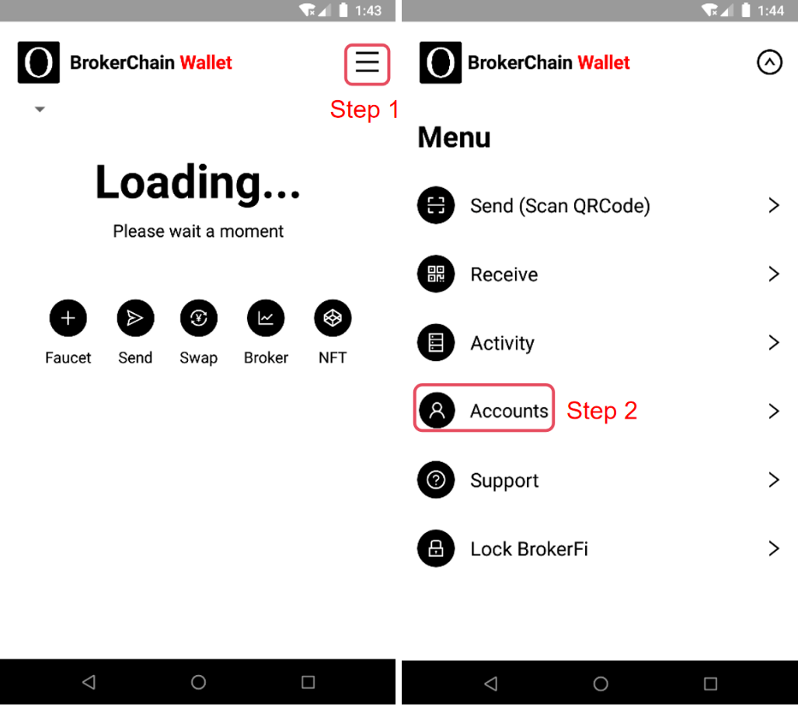
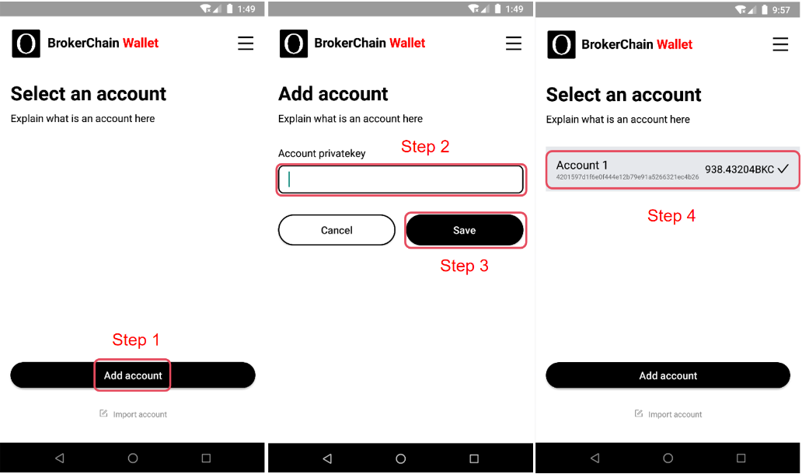
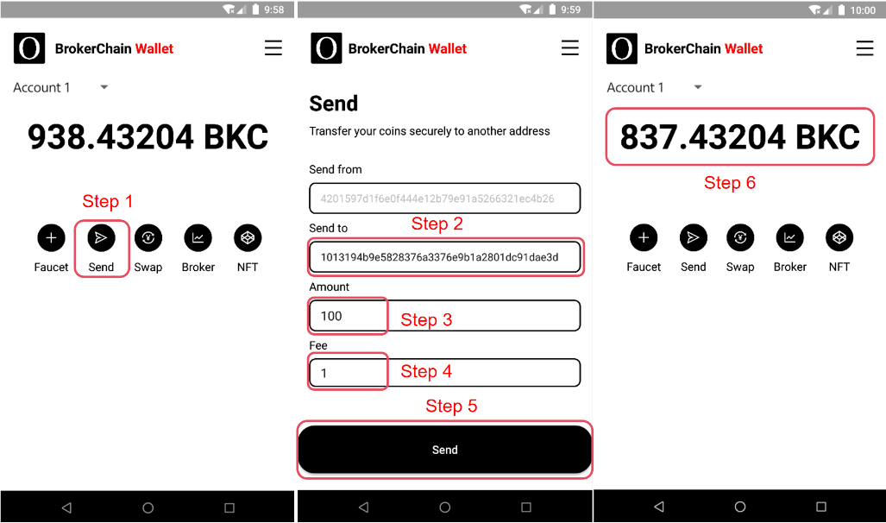
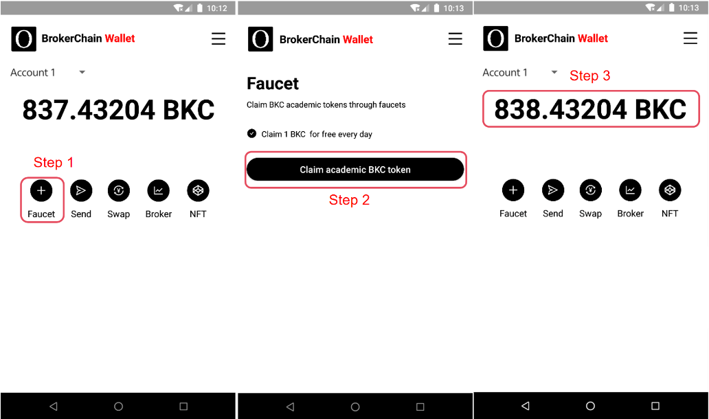

# BrokerChain Wallet

## Disclaimers

- BrokerChain (academic) is only for educational exchange purposes, and users are not allowed to engage in any illegal activities using BrokerChain (academic).
- Any direct or indirect consequences arising from users' use of BrokerChain are unrelated to the founding team of BrokerChain.
- The founding team of BrokerChain (academic) reserves the right to modify, update, or terminate BrokerChain (academic) without prior notice to users.
- When using BrokerChain (academic), users should bear the risks themselves and agree to waive any claims against the founding team.
- This disclaimer is governed by and interpreted according to the laws of the People's Republic of China.

## Download BrokerChain Wallet

Download the compiled **APK** file from the BrokerChain Wallet's Github repository Release page (https://github.com/HuangLab-SYSU/brokerwallet-academic/releases) and send it to your phone for installation. Currently, BrokerChain Wallet only supports Android devices. The iOS version will be released soon.

## Import Account

After entering the main page of BrokerChain Wallet, click on the upper right corner to enter the menu list, click on the Settings option to enter the settings page, and click on the Accounts option to enter the account management page.

After entering the account management page, click the Add account button and enter the account's private key to import it into the Account private key input box. (**Note that you should get the private key from the BrokerChain miner client, do not fill a key randomly, otherwise the wallet may fail to import account**)

Click the Save button to save this account. The account list will display the address and balance of the account that was just imported. Click on the account, select it, and it will be used as the payer account in the future.

## Initiate a transfer transaction

Enter the main page of BrokerChain Wallet. Click the Send button to enter the transfer page. Enter the recipient's account address in the Send to input box, the transfer amount (in BKC) in the Amount input box, and the transfer fee (in **BKC**) in the Fee input box. Click the Send button to initiate a transfer transaction. After the transfer is successful, return to the main page of BrokerChain Wallet, and you will see that the transfer amount and transaction fee have been deducted from the account balance. The transfer amount will be credited to the recipient's account, and the transfer fee will be used as the broker's income.

## Use the faucet function of BrokerChain Wallet to receive free coins

BrokerChain Wallet provides a "Faucet" function, allowing users to receive a small amount of test coins for free. Enter the main page of BrokerChain Wallet, click the Faucet button, and enter the faucet page. Click the Claim button to receive some BKC coins. Users can only receive once per account per day. However, each IP address can claim only a few faucet tokens.

